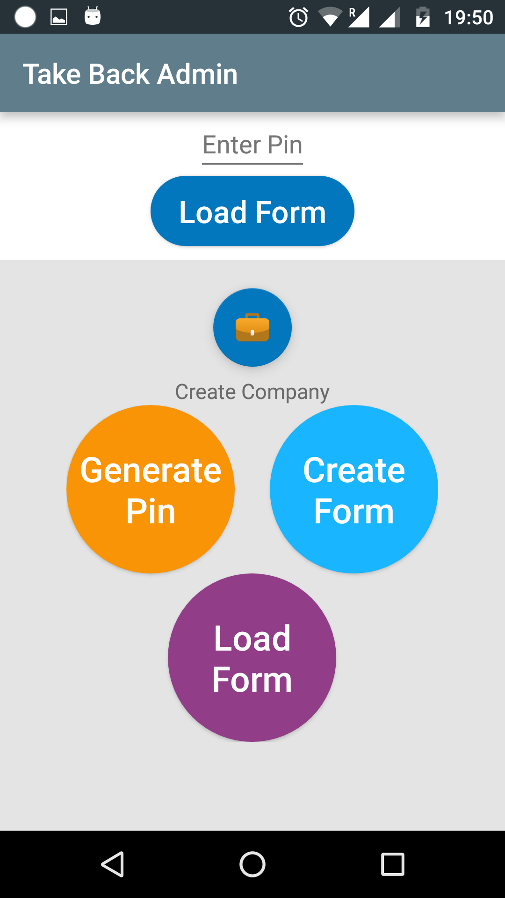

# TakeBack-user
Feedback / Survey Collection App for users or one who fills the feedback or survey
This application was first meant to be for commercial use. Later after building it, proper execution was not proper and therefore it is put here in GitHub so that project can flourish and help others.

The application is divided in two applications. One is for user and one is for admin.

You can get repository for user and admin app from the below links
https://github.com/jodiwaljay/TakeBack-user
https://github.com/jodiwaljay/TakeBack-admin

**Screenshots of the App**

  
 
